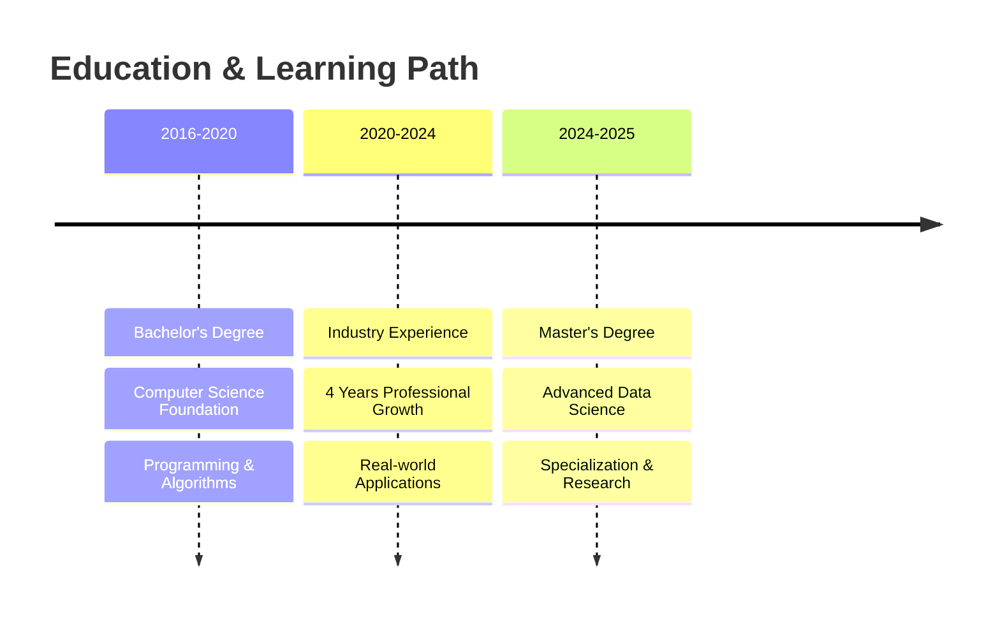

# 🚀 AMALDEV P J | Data Scientist & AI Engineer

<div align="center">


[](https://git.io/typing-svg)


</div>

---

## 📊 Professional Overview

<table>
<tr>
<td width="60%">

### 👨‍💻 About Me
Senior Data Scientist with **4+ years** of experience transforming complex datasets into actionable business insights. Currently pursuing **MSc in Data Science** at the University of Glasgow. Specialized in machine learning, predictive analytics, and business intelligence solutions.

**🎯 Key Achievements:**
- ✨ **15% Cost Reduction** through predictive analytics
- ⚡ **40% Process Optimization** via automated pipelines  
- 🛡️ **20% Resource Efficiency** improvement
- 👥 **12% Employee Retention** boost through HR analytics

</td>
<td width="40%">

### 📍 Contact Information
```yaml
Location: Glasgow, Scotland 🏴󠁧󠁢󠁳󠁣󠁴󠁿
Phone: +44 7553 990 655
Email: amaldevjayakumar@gmail.com
Status: Available for Opportunities
```

<div align="center">

[](https://linkedin.com/in/amaldev-p-j-389a01184/)
[](mailto:amaldevjayakumar@gmail.com)
[](tel:+447553990655)

</div>

</td>
</tr>
</table>

---

## 🎓 Academic Journey

<div align="center">


[](https://git.io/typing-svg)
</div>

### 🎯 Academic Timeline

<div align="center">



</div>

---

<table>
<tr>
<td width="50%">

<div align="center">

### 🏴󠁧󠁢󠁳󠁣󠁴󠁿 **UNIVERSITY OF GLASGOW**


</div>

<div align="center">

**🎓 Master of Science in Data Science**  


</div>

**🧠 Advanced Curriculum:**
```yaml
Semester 1:
  - Machine Learning Fundamentals
  - Statistical Methods for Data Science
  - Data Mining & Knowledge Discovery
  
Semester 2:
  - Deep Learning & Neural Networks
  - Big Data Analytics
  - Business Intelligence Systems
  
Research Focus:
  - Applied AI in Business Intelligence
  - Predictive Analytics Optimization
```

<div align="center">


</div>

</td>
<td width="50%">

<div align="center">

### 🇮🇳 **APJ ABDUL KALAM UNIVERSITY**


</div>

<div align="center">

**💻 Bachelor of Technology - Computer Science**  


</div>

**🏗️ Foundation Studies:**
```yaml
Core Subjects:
  - Data Structures & Algorithms
  - Object-Oriented Programming
  - Database Management Systems
  
Advanced Topics:
  - Software Engineering Principles
  - System Design & Architecture
  - Web Technologies & Frameworks
  
Final Project:
  - Enterprise Application Development
  - Database Optimization Techniques
```

<div align="center">


</div>

</td>
</tr>
</table>

---

<div align="center">

### 📚 **Continuous Learning & Development**

<table>
<tr>
<td align="center" width="25%">

<br/><strong>Academic Excellence</strong>
<br/>Advanced coursework in ML, statistics, and AI
</td>
<td align="center" width="25%">

<br/><strong>Industry Integration</strong>
<br/>Bridging theory with 4+ years of practice
</td>
<td align="center" width="25%">

<br/><strong>Research Focus</strong>
<br/>Exploring cutting-edge AI applications
</td>
<td align="center" width="25%">

<br/><strong>Future Ready</strong>
<br/>Preparing for next-gen data challenges
</td>
</tr>
</table>


</div>

---

## 🎮 Character Progression & Professional Journey

<div align="center">


[](https://git.io/typing-svg)
</div>

---

<div align="center">

### 🏆 **Character Stats & Progression**

```
╔══════════════════════════════════════════════════════════════╗
║                    AMALDEV THE DATA WIZARD                  ║
║                      Level: 85 (Senior)                     ║
╠══════════════════════════════════════════════════════════════╣
║ 💪 Strength (Technical Skills):     ████████████████████ 95%║
║ 🧠 Intelligence (Analytics):        ████████████████████ 90%║
║ ⚡ Agility (Efficiency):            ████████████████████ 85%║
║ 🎯 Precision (Accuracy):            ████████████████████ 88%║
║ 👥 Charisma (Leadership):           █████████████████    80%║
║ 🛡️ Defense (Problem Solving):       ████████████████████ 92%║
╚══════════════════════════════════════════════════════════════╝
```

</div>

---

<div align="center">

### ⏳ **Character Evolution Timeline**

</div>

<table>
<tr>
<td width="20%" align="center">

### 🌱 **2016-2020**
**Novice Developer**


**Level: 1-15**
```
📚 Gained: BTech Degree
🔧 Learned: Java, Basic SQL
💡 Skills: Programming Fundamentals
🎯 Status: Foundation Building
```


</td>
<td width="20%" align="center">

### ⚔️ **2020-2021**
**Data Apprentice**


**Level: 16-35**
```
🏢 Joined: Cognizant
📊 Mastered: Power BI, SQL
🛠️ Built: First Dashboards
🎯 Status: Skill Development
```


</td>
<td width="20%" align="center">

### 🏅 **2021-2022**
**Analytics Warrior**


**Level: 36-55**
```
🤖 Acquired: ML Skills
🔮 Unlocked: Predictive Models
📈 Achievement: 15% Cost Save
🎯 Status: Intermediate
```


</td>
<td width="20%" align="center">

### 👑 **2022-2024**
**Senior Data Mage**


**Level: 56-80**
```
🏆 Earned: 6 Certifications
☁️ Mastered: Azure Cloud
🎯 Led: Multiple Projects
🎯 Status: Advanced Expert
```


</td>
<td width="20%" align="center">

### 🔮 **2024-2025**
**AI Architect**


**Level: 81-85**
```
🎓 Pursuing: MSc Data Science
🚀 Building: AI Projects
🧠 Research: Deep Learning
🎯 Status: Master Level
```


</td>
</tr>
</table>

---

<div align="center">

### 🎒 **Inventory & Equipment**

</div>

<table>
<tr>
<td width="50%">

#### ⚔️ **Weapons (Programming Languages)**
```
🐍 Python Sword             [★★★★★] Legendary
📊 SQL Shield               [★★★★★] Epic  
☕ Java Bow                 [★★★☆☆] Rare
🌐 JavaScript Dagger        [★★☆☆☆] Common
```

#### 🛡️ **Armor (Frameworks & Tools)**
```
🔥 PyTorch Armor            [★★★★☆] Epic
🛠️ Scikit-Learn Gauntlets   [★★★★★] Legendary
📊 Power BI Helmet          [★★★★★] Legendary
☁️ Azure Cloak              [★★★★☆] Epic
```

#### 💎 **Accessories (Certifications)**
```
🏅 Microsoft Power BI Ring  [Equipped]
☁️ Azure Data Engineer Badge [Equipped]
🔮 Oracle Analytics Amulet   [Equipped]
📚 Udemy Learning Scrolls    [Collection: 3]
```

</td>
<td width="50%">

#### 🏰 **Achievements Unlocked**

<div align="center">

  
*Defeated 15% Cost Dragon*

  
*Achieved 40% Efficiency Boost*

  
*Protected 20% More Resources*

  
*Improved Retention by 12%*

  
*Built 20+ Epic Dashboards*

  
*Pursuing Advanced Degree*

</div>

#### 📈 **Experience Points Breakdown**
```yaml
Education Quests:        2,500 XP
Professional Battles:    8,000 XP
Certification Raids:     1,800 XP
Project Completions:     3,200 XP
Innovation Bonus:        1,500 XP
─────────────────────────────────
Total Experience:       17,000 XP
```

</td>
</tr>
</table>

---

<div align="center">

### 🎯 **Current Quest & Future Missions**

<table>
<tr>
<td width="33%" align="center">

**🎓 Main Quest**
<br/>

<br/>
**Complete MSc Data Science**
<br/>

<br/>
*Reward: +15 Intelligence*

</td>
<td width="33%" align="center">

**🚀 Side Quest**
<br/>

<br/>
**Build AI Portfolio**
<br/>

<br/>
*Reward: +10 Innovation*

</td>
<td width="33%" align="center">

**🌟 Daily Quest**
<br/>

<br/>
**Learn New Technologies**
<br/>

<br/>
*Reward: +5 All Stats*

</td>
</tr>
</table>

</div>

---

<div align="center">

### 🏛️ **Guild Affiliations & Reputation**

<table>
<tr>
<td width="25%" align="center">

**🏢 Cognizant Guild**
<br/>

<br/>
*Senior Member (4 Years)*

</td>
<td width="25%" align="center">

**🏴󠁧󠁢󠁳󠁣󠁴󠁿 Glasgow Academy**
<br/>

<br/>
*Active Student*

</td>
<td width="25%" align="center">

**💻 Microsoft Alliance**
<br/>

<br/>
*Certified Member*

</td>
<td width="25%" align="center">

**🔮 Oracle Circle**
<br/>

<br/>
*Analytics Expert*

</td>
</tr>
</table>


</div>

---

## 🛠️ Technical Arsenal & Skills Matrix

<div align="center">


[](https://git.io/typing-svg)
</div>

---

<div align="center">

### 💻 **Core Programming Languages**

<table>
<tr>
<td width="33%" align="center">


<br/>
**🐍 Python**
<br/>

<br/>

<br/>
<sub>Pandas • NumPy • Scikit-Learn • Matplotlib</sub>

</td>
<td width="33%" align="center">


<br/>
**📊 SQL**
<br/>

<br/>

<br/>
<sub>SQL Server • Oracle • MySQL • SQLite</sub>

</td>
<td width="33%" align="center">


<br/>
**☕ Java**
<br/>

<br/>

<br/>
<sub>Enterprise Applications • Backend Development</sub>

</td>
</tr>
</table>

</div>

---

<div align="center">

### 🤖 **Machine Learning & Analytics Stack**

<table>
<tr>
<td width="50%">

#### **🧠 ML Frameworks & Libraries**
<div align="center">


</div>

```yaml
Specializations:
  - Deep Learning & Neural Networks
  - Predictive Analytics & Forecasting
  - Statistical Analysis & Modeling
  - Data Mining & Pattern Recognition
  - Computer Vision (Swin-LSTM)
```

</td>
<td width="50%">

#### **📊 Data Visualization & BI Tools**
<div align="center">


</div>

```yaml
Expertise:
  - Interactive Dashboard Development
  - Real-time Data Monitoring
  - Executive Reporting & KPIs
  - Self-Service Analytics
  - Report Server Management
```

</td>
</tr>
</table>

</div>

---

<div align="center">

### ☁️ **Cloud & Database Technologies**

<table>
<tr>
<td width="25%" align="center">


<br/>
**Microsoft Azure**
<br/>

<br/>
<sub>Data Engineering • Cloud Analytics</sub>

</td>
<td width="25%" align="center">


<br/>
**SQL Server**
<br/>

<br/>
<sub>SSMS • Database Design</sub>

</td>
<td width="25%" align="center">


<br/>
**Oracle**
<br/>

<br/>
<sub>Enterprise Databases</sub>

</td>
<td width="25%" align="center">


<br/>
**MySQL**
<br/>

<br/>
<sub>Data Warehousing</sub>

</td>
</tr>
</table>

</div>

---

<div align="center">

### 🔧 **Development Tools & Platforms**

<table>
<tr>
<td width="50%">

#### **💻 IDEs & Development**
<div align="center">


</div>

</td>
<td width="50%">

#### **📋 Business & Productivity**
<div align="center">


</div>

</td>
</tr>
</table>

</div>

---

<div align="center">

### 🎯 **Soft Skills & Leadership**

<table>
<tr>
<td width="25%" align="center">


<br/>
**👥 Stakeholder Management**
<br/>
<sub>Cross-functional collaboration</sub>

</td>
<td width="25%" align="center">


<br/>
**🤝 Rapport Building**
<br/>
<sub>Client relationship management</sub>

</td>
<td width="25%" align="center">


<br/>
**👨‍💼 People Management**
<br/>
<sub>Team leadership & mentoring</sub>

</td>
<td width="25%" align="center">


<br/>
**💬 Communication**
<br/>
<sub>Technical & business alignment</sub>

</td>
</tr>
</table>


</div>

---

## 🚀 Featured Projects

<div align="center">

</div>

### 🎬 Bayesian Video Prediction System
<div align="center">


</div>

**🎯 Objective:** Advanced video forecasting with uncertainty quantification  
**🔧 Technology:** Swin-LSTM, Bayesian Neural Networks, Monte Carlo Dropout  
**📈 Impact:** Real-time decision support with frame-level confidence metrics

---

### 🤖 RAG-Powered Knowledge Assistant
<div align="center">


</div>

**🎯 Objective:** Enterprise knowledge management with adaptive learning  
**🔧 Technology:** Vector databases, LLM integration, containerized deployment  
**📈 Impact:** 40% improvement in answer relevance and real-time monitoring

---

### 💰 Financial Operations Dashboard
<div align="center">


</div>

**🎯 Objective:** Automated financial analytics and expense forecasting  
**🔧 Technology:** ETL automation, predictive modeling, interactive dashboards  
**📈 Impact:** 10+ hours/week time savings with actionable financial insights

---

## 🏆 Certifications & Achievements

<div align="center">

</div>

<table>
<tr>
<td width="50%">

### 🎖️ Microsoft Certifications
[](https://learn.microsoft.com/en-us/users/amaldevpj/credentials)
[](#)

### 🔮 Oracle Cloud Certification
[](#)

</td>
<td width="50%">

### 📚 Specialized Training
[](#)
[](#)
[](#)

</td>
</tr>
</table>

---

## 📈 GitHub Analytics

<div align="center">

</div>

<div align="center">
<table>
<tr>
<td width="50%">

</td>
<td width="50%">

### 📊 Key Metrics
```
🎯 Total Projects: 15+
☕ Coffee Consumed: 1,460 cups
📊 Dashboards Built: 20+
🤖 ML Models Deployed: 10+
📈 Certifications: 6
👥 Users Impacted: 500+
```

</td>
</tr>
</table>
</div>

---

## 🎯 Current Focus & Goals

<div align="center">

</div>

<table>
<tr>
<td width="33%" align="center">

### 🎓 Academic Excellence
Completing MSc in Data Science  
Focus on advanced ML techniques  
Research in neural networks

</td>
<td width="33%" align="center">

### 🚀 Professional Growth
Seeking challenging data roles  
Building portfolio projects  
Expanding cloud expertise

</td>
<td width="33%" align="center">

### 🌟 Innovation
Exploring generative AI  
Contributing to open source  
Mentoring aspiring data scientists

</td>
</tr>
</table>

---

## 📞 Let's Connect!

<div align="center">


### Ready to collaborate on data-driven solutions?

[](https://linkedin.com/in/amaldev-p-j-389a01184/)
[](mailto:amaldevjayakumar@gmail.com)
[](tel:+447553990655)

### 💡 *"Turning data into insights, insights into action, and action into impact."*


</div>

---

<div align="center">
<sub>⚡ This profile is powered by passion for data science and continuous learning</sub>
</div>
